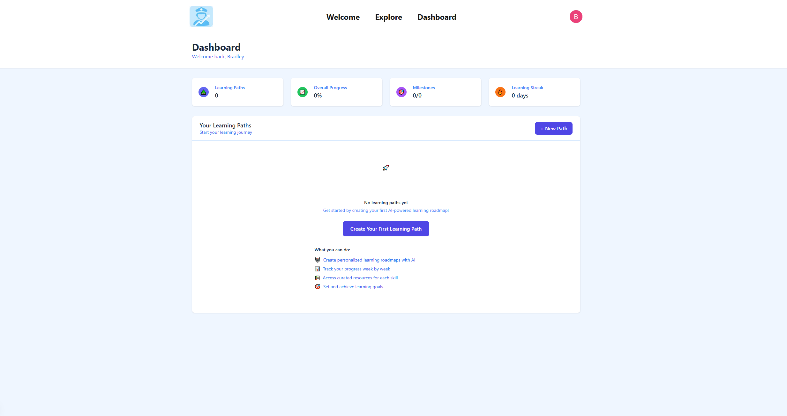
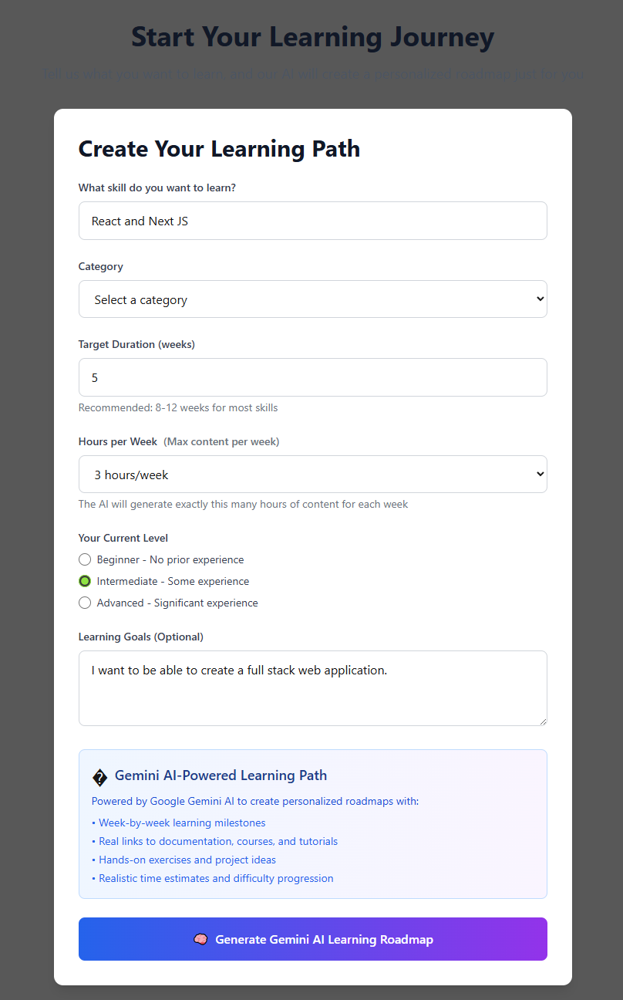
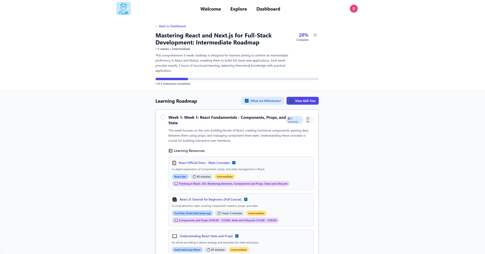
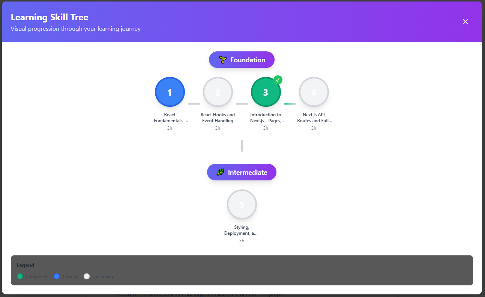
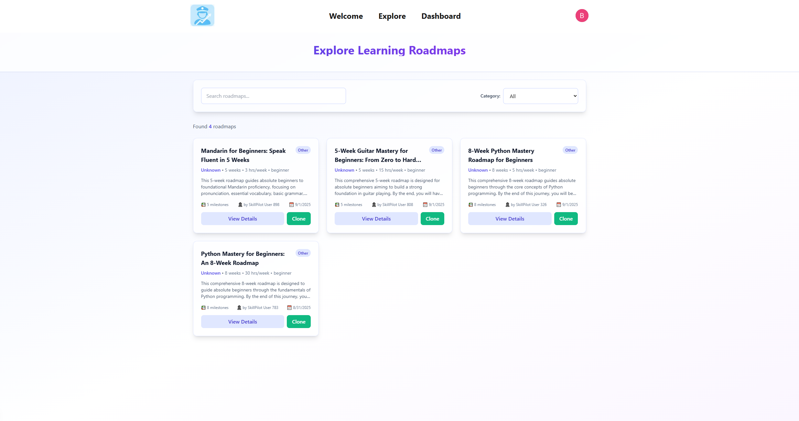
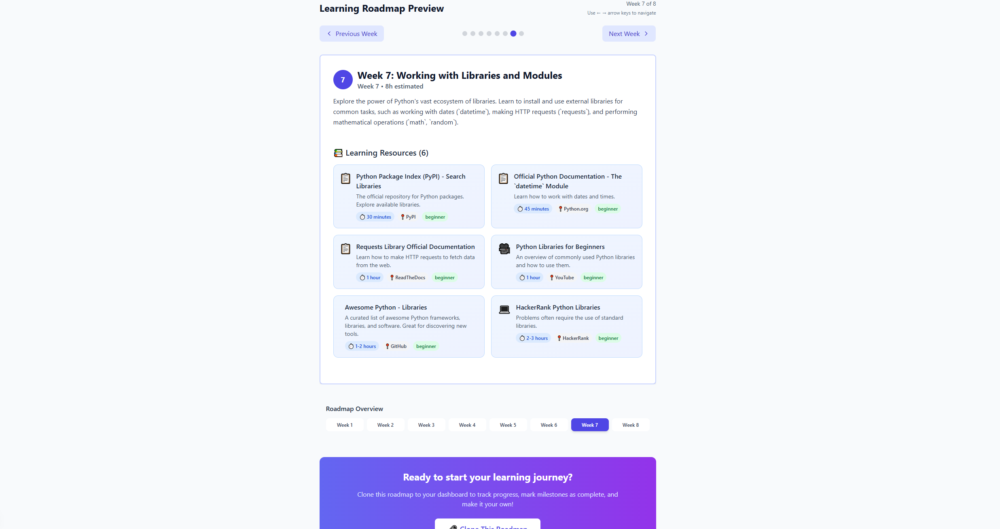

# SkillPilot 

**ACCESS WEBSITE [HERE](https://skillpilotapp.vercel.app/welcome)**

A full-stack Next.js application leveraging Gemini AI to create customized educational skill building roadmaps. Features include user authentication via Clerk, PostgreSQL database with Supabase, styled with Tailwindcss and responsive React components, and milestone-based progress tracking. 

---

## 🚀 Features
- 📲 **Mobile Compatible** Works seemlessly on mobile devices
- 🔄 **Account and roadmap management** PostgreSQL Database 
- 🎨 **Interactive UI/UX** responsive design  
- 👥 **Live collaboration** through follows and post saves
  
---

## 🧰 Tech Stack

- 📘Typescript - Programming Language
- 📁Next.js - Web Framework and installation packages
- 🎨Tailwindcss - CSS Framework
- 🗄️Supabase - Database PostgreSQL
- 🔐Clerk - Secure user authentication 

Website Deployment 
- 🎯 Vercel

---

Features Coming Soon
- 📜 See most popular roadmaps by other users
- 📅 Import roadmaps directly into your google calendar

---

### 🖼️Demos/Screenshots

